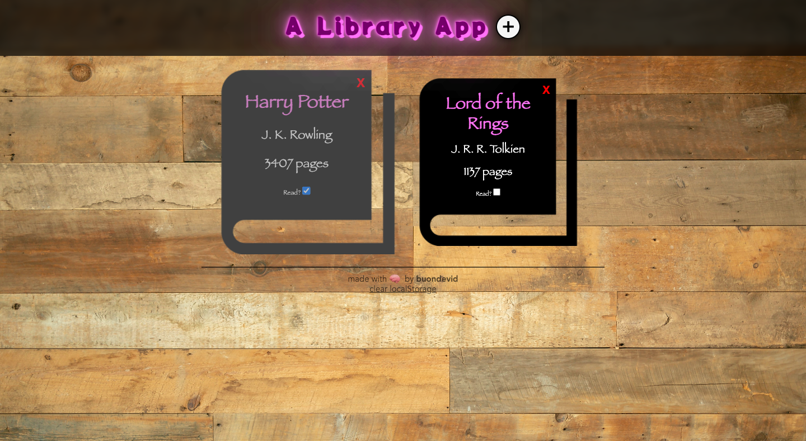
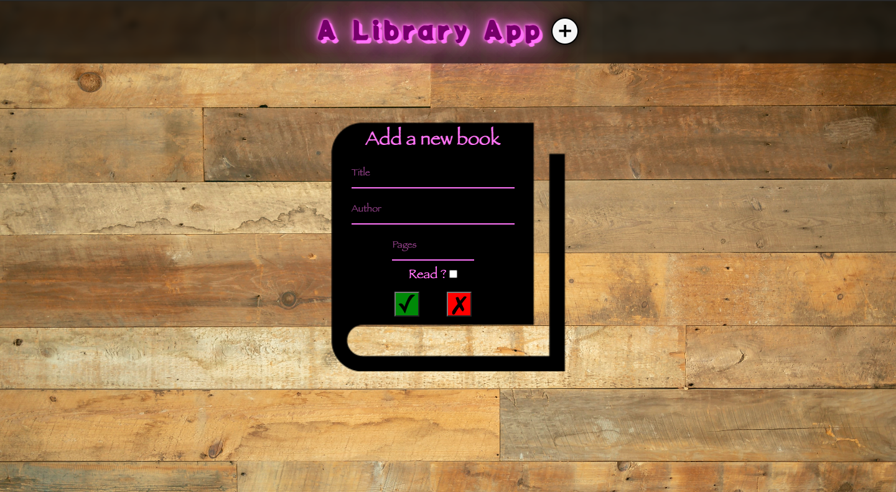

<h1 align='center'>Library</h1> 

	

	

This app was created using only HTML, CSS and Vanilla JS.

This is a personal project, built to practice what I've learned on T.O.P.

It's a library app that allows you to add and store your books in a catalogue. 

It's responsive and it has a **localStorage** that keeps your data saved forever, given that you use the same browser and device. You can clear the data with a handy click at the bottom of the page, but you know, it's a sin to waste books!

:link: **Live preview:** [here](https://buondevid.github.io/library/)

:link: **GitHub repo:** [here](https://github.com/buondevid/library)

## Stack & Tools  :hammer:

- HTML
- CSS
- Vanilla JS
- VS Code + ESLint + Node
- Git & GitHub

## What I learned :book:

- Learned and increased knowledge in **Data structures**, objects manipulations, **constructors** and **classes**.
- Deepened my knowledge in *Event Listeners* when creating dynamic content.
- Improved **DOM manipulation** with **properties** by creating nearly all the HTML on JS.
- Learned how to use the **Web Storage API**, both *local* and *session*.
	- Used it to store an entire object with `JSON stringify`, while normally it just holds key/value pairs.
- Explored new **CSS** properties like `filter`, `backdrop-filter`; use of `::before/::after` pseudo-elements.
	- Learned how to manage *animation* and **transitions** with JS .classlist manipulations.
- Improved responsiveness planning, needing very little *@media querying*.

## What could be improved :mag: 

* Widen my object/arrays manipulations.
* Become more confident in CSS styling and positioning.
* Improve images/icons management.

## Author

:moyai: **buondevid** --> [GitHub](https://github.com/buondevid)